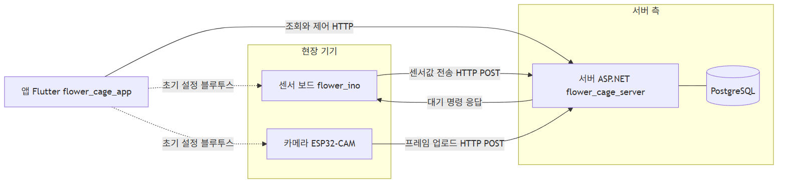
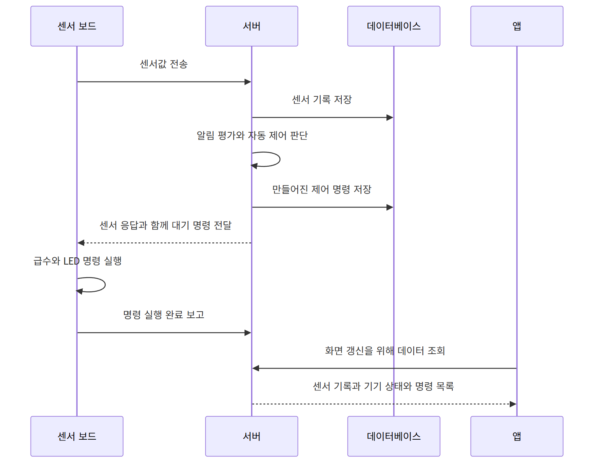
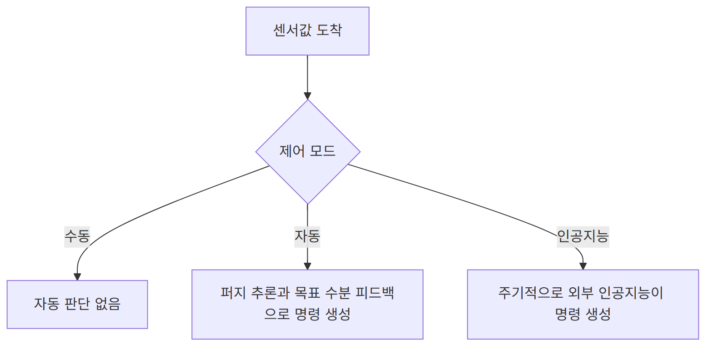
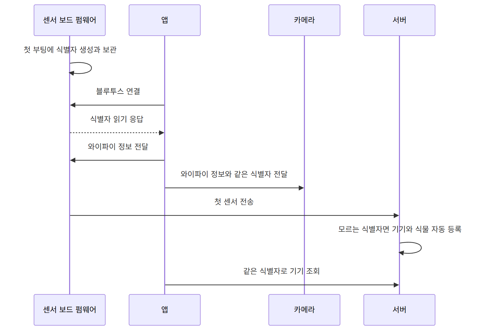
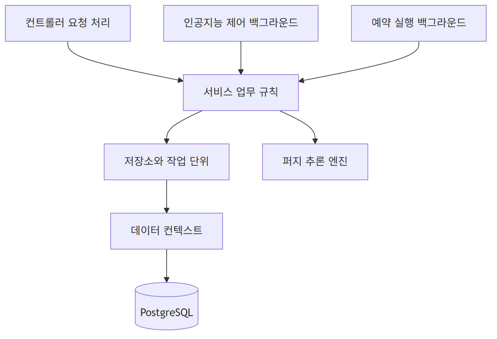

# 전체 구성과 흐름 (ARCHITECTURE.md)

이 문서는 스마트 화분 시스템의 전체 구성과 데이터 흐름을 정리한 것입니다. 아래 구성도는 마크다운 뷰어에서 그림으로 보이는 mermaid 다이어그램입니다.

## 시스템 구성

시스템은 네 개의 실행 주체와 하나의 데이터베이스로 이루어집니다. 식물을 돌보는 센서 보드, 영상을 올리는 카메라, 모든 데이터를 모으고 판단하는 서버, 사용자가 보는 앱, 그리고 서버가 쓰는 데이터베이스입니다.

실선은 평소 운영 중에 오가는 통신이고, 점선은 처음 기기를 설정할 때만 쓰는 블루투스 통신입니다.

## 구성 요소 설명

센서 보드는 아두이노 MKR 계열 보드에서 동작합니다. 토양 수분과 온도와 습도와 조도와 스펙트럼을 읽어 일정 주기마다 서버로 보내고, 서버가 내려준 급수와 LED 명령을 실행합니다. 펌프와 LED를 직접 제어하는 쪽이 이 보드입니다.

카메라는 ESP32-CAM 보드에서 동작합니다. 와이파이에 붙은 뒤 일정 주기로 카메라 프레임을 서버에 올립니다. 서버는 이 프레임을 받아 두었다가 앱이 요청할 때 보여줍니다.

서버는 ASP.NET으로 만든 웹 서비스입니다. 센서 데이터를 저장하고, 자동 제어를 판단해 명령을 만들고, 알림과 분석 기록을 남기며, 앱과 기기가 주고받는 모든 요청을 처리합니다. 데이터는 PostgreSQL에 저장합니다.

앱은 Flutter로 만든 모바일 앱입니다. 서버에서 센서 기록과 기기 상태와 제어 명령을 읽어 화면에 보여주고, 사용자가 모드 변경이나 급수나 조명 같은 제어를 하면 서버에 요청을 보냅니다. 기기를 처음 설정할 때는 블루투스로 와이파이 정보를 전달하고 기기 식별자를 읽어 옵니다.

데이터베이스는 사용자와 기기와 식물과 환경설정과 센서 기록과 제어 명령과 알림과 분석 기록을 담습니다.

## 센서 데이터와 자동 제어 흐름

평소 운영 중에는 아래 순서로 데이터가 흐릅니다. 센서 보드가 측정값을 보내면 서버가 저장하고, 자동 모드이면 그 자리에서 제어를 판단해 명령을 만들고, 그 명령을 응답에 실어 돌려줍니다. 센서 보드는 받은 명령을 실행하고 완료를 보고합니다.

예전에는 센서 보드가 명령을 따로 한 번 더 조회했지만, 지금은 센서 전송 응답에 대기 명령을 함께 담아 보내므로 통신 왕복이 한 번 줄었습니다.

## 제어 모드

각 식물은 수동과 자동과 인공지능 가운데 한 가지 모드로 동작합니다.

수동 모드에서는 자동 판단이 전혀 없고, 사용자가 앱에서 직접 보낸 명령만 실행됩니다.

자동 모드에서는 센서값이 들어올 때마다 서버가 규칙과 퍼지 추론으로 제어를 판단합니다. 토양 수분은 목표 수분까지 한 번에 일 초씩만 급수하는 피드백 방식으로 다룹니다. 현재 수분이 목표보다 낮으면 일 초 급수하고 다음 측정에서 다시 판단하므로, 펌프 유량을 몰라도 목표로 수렴합니다. 조도는 퍼지 추론으로 밝음과 적정과 어두움과 매우 어두움을 따져 LED 밝기를 정합니다. 온도와 습도는 직접 제어할 수단이 없어 범위를 벗어나면 경고만 남깁니다.

인공지능 모드에서는 백그라운드 서비스가 일정 주기마다 최신 센서값과 목표값을 모아 외부 인공지능에 분석을 요청하고, 그 결과를 제어 명령으로 바꿉니다.

## 초기 설정과 식별자 흐름

기기 식별자는 펌웨어가 소유합니다. 센서 보드는 첫 부팅 때 식별자를 직접 만들어 내부 저장소에 보관하고, 이후 재부팅이나 전원 차단에도 같은 값을 씁니다. 앱은 블루투스로 그 식별자를 읽어 와 서버 등록과 화면 표시에 쓰고, 같은 식별자를 카메라에도 전달해 영상이 같은 기기에 묶이게 합니다.

서버는 모르는 식별자로 데이터가 들어와도 막지 않고 그 식별자로 기기와 식물과 기본 환경설정을 자동으로 만듭니다. 덕분에 서버를 재시작해 데이터가 비거나 식별자가 어긋나도 다음 전송에서 스스로 복구됩니다. 자동으로 만든 식물은 의도치 않은 급수를 막기 위해 수동 모드로 시작합니다.

## 서버 내부 구조

서버는 요청을 받는 컨트롤러, 업무 규칙을 담은 서비스, 데이터 접근을 감싸는 저장소, 데이터베이스 매핑을 담은 엔티티로 나뉩니다. 주기적으로 도는 작업은 백그라운드 서비스로 따로 돌립니다.

컨트롤러는 들어온 요청을 알맞은 서비스로 넘깁니다. 서비스는 실제 판단과 처리를 하며, 자동 제어 서비스는 조명 판단을 퍼지 추론 엔진에 맡깁니다. 서비스는 저장소를 통해 데이터를 읽고 쓰고, 저장소는 데이터 컨텍스트를 거쳐 데이터베이스에 닿습니다. 인공지능 제어와 예약 실행은 주기적으로 깨어나 서비스를 호출하는 백그라운드 작업으로 동작합니다.
